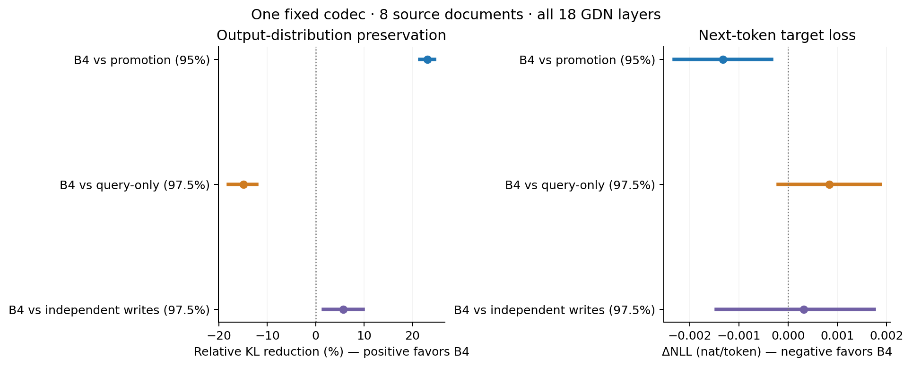

# RTPA — Output-Aware Recurrent-State Quantization

RTPA uses offline output-response measurements to guide **fixed precision allocation**
(RTPA-DIAG) and **bounded integer-code correction** (FA_CODE), with quality,
storage and runtime measured separately. Both aim to preserve a model's output
under a fixed state-storage budget. Each method has its own baseline and evaluation.

RTPA quantizes the **persistent recurrent state between token updates**. It does
not quantize model weights or GEMM activations. The current research direction
is [output-sensitive allocation on a numerically sound storage path](docs/RESEARCH_DIRECTION.md).

## What you can use and verify

Runnable today: a model-free CPU demonstration, public evidence reconstruction,
and a limited opt-in GDN adapter. GDN2 remains operator-only. Start with the
[current guide](docs/QUICKSTART_R4.md); [security and input trust](SECURITY.md)
apply before loading captures.

The fixed-codec R4 table below is copied from the
[canonical result renderer](results/diag_r4/benchmark_tables.md), not a new run.
All mixed rows use the same 19,328 B/head, legacy P_PRE/high8/all18 GDN scope;
KL is `Native || method` in nat/token on eight source documents.

| Method | Mean KL, nat/token | Mean NLL, nat/token | ΔNLL vs Native | exp(ΔNLL) |
|---|---:|---:|---:|---:|
| Native | 0 | 1.301713 | 0 | 1 |
| Promotion energy / B1 | 0.0055315696 | 1.3075968 | 0.0058837611 | 1.0059011 |
| Query weighted / B2 | 0.0037010873 | 1.3054351 | 0.0037221157 | 1.0037291 |
| Independent writes + 2c / B3 | 0.0045103933 | 1.3059561 | 0.0042430643 | 1.0042521 |
| Coherent DIAG / B4 | 0.0042546703 | 1.3062713 | 0.0045582713 | 1.0045687 |

B2, the fixed query-weighted control, has lower KL than DIAG on all eight
documents. The observed allocation differences do not establish DIAG task
advantage, a latency bound or whole-model VRAM reduction.

- **Measured allocation trade-offs:** on eight fixed source documents,
  Qwen3.5-0.8B-Base and all 18 GDN layers, coherent DIAG lowers mean
  Native-reference KL by **23.08%** versus promotion energy (95% CI
  21.53–24.58%) at the same payload. However, its pooled KL is **14.96% higher**
  than the simpler query-weighted score, and it loses all eight document
  comparisons. The evidence
  supports output-sensitive allocation, not the need for the most elaborate
  score. [Quality, NLL and tail table](results/diag_r4/benchmark_tables.md).
- **A controlled allocation comparison:** promotion energy, query weighting,
  independent-write response and coherent DIAG share one storage codec,
  TRAIN input, source sampling and high-row budget. The current study measures
  all 18 GDN layers and separates a score's contribution from a codec change.
  [Attribution study](docs/DIAG_ATTRIBUTION_R4.md).
- **Reproducible numerical and calibration boundaries:** independent small
  response checks, exact adjoints, row-chunked calibration, fixed masks and
  token-level observations. Probe masks that are not certified stay uncertified;
  a rounding-codec candidate that missed DEV quality criteria is not a default.
  [Method and controls](docs/METHOD.md).
- **Explicit storage:** 19,328 B per 128×128 head, including FP16 metadata and
  eight high rows — **9.4375 bits/value**, 41.02% below the same head's BF16
  state. All 18 GDN layers use 5,566,464 target-state bytes. Policy indices,
  transforms, counters, scratch and whole-model peak are accounted separately;
  **state-storage reduction is not the same as whole-VRAM reduction**.
  [Measurement scope](docs/BENCHMARKS.md).
- **Runnable, auditable paths:** fixed-mask GDN adapters, independent CPU codec
  checks, public token/sequence observations and model-free table reconstruction.
  [Current executable guide](docs/QUICKSTART_R4.md).

Earlier measurements remain separate evidence. R2-DIAG improved its R2-energy
baseline by 58.10%, but its mean KL was **16.34× worse than legacy DIAG**;
it is not a recommended quality replacement. Three-layer FA_CODE improved
KL by 3.05% but cost 1.498× its stored-nearest baseline in a different run.
Historical task panels did not establish added answer accuracy.
[All results and adverse comparisons](docs/RESULTS.md). These gains are never added.

The latest [grid-feedback diagnostic](docs/GRID_FEEDBACK.md) explains why a
smaller one-write error or zero repeated-snapshot drift is not enough: holding
a first grid fixed removes drift but clips an evolving state; a TRAIN-envelope
grid still has 3.15× legacy readout SSE in frozen-operand replay. Neither tested
practical codec passed the predeclared CPU quality screen, so no new model
benchmark or stable default is claimed from this cycle.



The current intervals are paired by source document within software project.
They concern output preservation, not task accuracy or a population-wide
performance guarantee. [Runtime and memory](results/diag_r4/cost_tables.md)
are a separate axis: this run's timing was blocked by GPU isolation checks,
and no new peak-VRAM measurement is available. Static masks do not establish
zero overhead; the +5% cost target remains unassessed for this comparison.

## Support and measurement scope

| Architecture | Executable path | Evidence level |
|---|---|---|
| GDN / Qwen3.5-0.8B-Base, fixed revision | Native whole-model token steps; all 18 recurrent-layer allocation; separate layers 0/12/22 FA_CODE | `MODEL_EVALUATED`; exact scope and completion per method in the benchmark tables |
| GDN2 | Independent channel-wise transition/adjoint, calibration and quantized operator runner | `OPERATOR_TESTED`; no verified official pretrained checkpoint integration, no language-model KL/NLL claim |

The measured GPU is an RTX 5080 16 GB, with BF16 model/cache and FP32 recurrent
updates. Attention KV, model weights and activations are not quantized here.
Storage uses real UINT8/FP16 tensors and eager encode/decode, not a fused or
optimized packed inference kernel. The legacy FP16 zero-point overflow remains
reproducible. R2 uses a different decoder with a declared finite-input range;
its successful fixtures and panel do not establish universal codec safety.
The current attribution study uses the legacy codec only as a quality reference;
no new stable default is promoted.
[Architecture provenance](docs/ARCHITECTURES.md) · [Numerical limitations](docs/LIMITATIONS.md).

## Quickstart

Install from the repository with Python 3.11:

```bash
git clone https://github.com/Munsik-Kim/rtpa-research.git
cd rtpa-research
python3.11 -m venv ../rtpa-demo-env
source ../rtpa-demo-env/bin/activate
python -m pip install .
python -m rtpa_research demo --out demo.json
python -m rtpa_research verify --out recomputed
python -m rtpa_research.maintenance_verify --out recomputed-r4.json
python -m rtpa_research.grid_report --out recomputed-grid
python -m rtpa_research.grid_verify --out recomputed-grid-check.json
```

The demo and evidence commands run on CPU without Torch or model weights.
They reconstruct the included observations; they do not run model inference.
R4 verification keeps its historical source expectations and reports the
current version metadata separately through an explicit temporary projection.
For a state encode/decode example, calibration dependencies and an opt-in
model replay, use the [current guide](docs/QUICKSTART_R4.md).
The [R2 guide](docs/QUICKSTART_R2.md) and [earlier guide](docs/QUICKSTART.md)
retain the distinct numerical paths that generated previous results.

## How it works

For a fixed response, state-error energy is `eᵀe`, whereas future readout
distortion is `eᵀLᵀLe`. Different error directions can therefore have different
output effects even at the same norm. RTPA uses that distinction in two ways:

1. **RTPA-DIAG:** measure transition/readout responses offline and select eight
   protected rows using `Kii+2ci`. Runtime applies a fixed mask; it does not
   replace the real transition by a diagonal matrix.
2. **FA_CODE:** use a frozen metric `M=lambda I+UUᵀ` to choose limited signed
   code changes at the current write. The factorized FP64 implementation avoids
   dense M storage while retaining the same checked caps, tie order and decoder.

Neither encoder reads future TEST tokens or a Native shadow state. Offline
response predictions are distinguished from the candidate's own nonlinear model
trajectory and actual answers. [Method](docs/METHOD.md) · [Hypotheses](docs/HYPOTHESES.md).

## Evidence, reuse and limits

Historical task panels did not establish added accuracy over simple baselines;
near-ceiling ties do not prove equivalence. This repository provides research
implementations with distinct numerical contracts and measured limitations.

- [Benchmarks and scope](docs/BENCHMARKS.md)
- [Grid feedback, numerical boundaries and exact reproduction levels](docs/GRID_FEEDBACK.md)
- [Research direction](docs/RESEARCH_DIRECTION.md) · [Temporal error theory](docs/TEMPORAL_ERROR_THEORY.md)
- [Integrated results, including failures](docs/RESULTS.md)
- [Reproducibility and data availability](docs/REPRODUCIBILITY.md)
- [Current packaging, input boundaries and software identity](docs/MAINTENANCE.md)
- [References and baseline provenance](docs/REFERENCES.md)
- [Closest prior work and contribution boundaries](docs/RELATED_WORK_AND_NOVELTY.md)
- [Historical experiment mapping](docs/EXPERIMENTS.md)
- [Limitations](docs/LIMITATIONS.md)
- [Current attribution claims](results/diag_r4/claims.json) · [R2 claims](results/diag_r2/claims.json) · [GDN/GDN2 claims](results/upgrade/claims.json) · [historical claims](results/claims.json)

## License and citation

Original contributions use **[Apache-2.0](LICENSE)**. Preserve applicable license,
copyright/attribution and [NOTICE](NOTICE) requirements and identify modifications.
See [third-party notices](THIRD_PARTY_NOTICES.md) for the unchanged Qwen tokenizer
attribution and the scope of included materials. External GDN2 code under its
own noncommercial license has not been vendored or relicensed here.

Please cite the repository and the commit used; [CITATION.cff](CITATION.cff)
contains the author and version metadata. A scholarly citation is a request,
not an additional license restriction.
