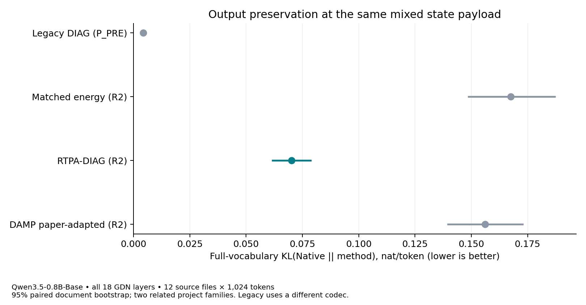

# RTPA — Output-Aware Recurrent-State Quantization

RTPA uses offline output-response measurements to guide **fixed precision allocation**
(RTPA-DIAG) and **bounded integer-code correction** (FA_CODE), with quality,
storage and runtime measured separately. Both aim to preserve a model's output
under a fixed state-storage budget. Each method has its own baseline and evaluation.

## What you can use and verify

- **Output-aware allocation under a fixed budget:** on the R2 12-source-file
  panel, R2-DIAG reduces Native-reference KL by **58.10% [54.40–61.15]%** against
  R2 matched energy, at the same codec and payload. **It is nevertheless much
  worse than legacy DIAG:** mean KL is **0.07019 versus 0.004296 nat/token**.
  R2 is an experimental numerical revision, not a recommended
  quality replacement. [All five methods and paired intervals](results/diag_r2/benchmark_tables.md).
- **A bounded repair of a known representation failure:** two R2 codec
  candidates reconstruct the saved finite-input FP16 zero-point overflow
  fixtures without nonfinite values. All 60 registered quality trajectories
  completed. This does not establish universal stability or explain the
  observed quality regression. [Numerical contract](docs/CODEC_R2_CONTRACT.md).
- **Explicit storage:** 19,328 B per 128×128 head, including FP16 metadata and
  eight high rows — **9.4375 bits/value**, 41.02% below the same head's BF16
  state. All 18 GDN layers use 5,566,464 target-state bytes. Whole-model peak
  allocated VRAM was **1,708.41 MiB for R2-DIAG versus 1,701.13 MiB for Native**:
  this run did not reduce whole-model peak. [Memory and bounded scratch measurements](results/diag_r2/memory_tables.md).
- **Runnable, auditable paths:** fixed-mask GDN adapters, independent CPU codec
  checks, public token/sequence observations and model-free table reconstruction.
  **R2 cost is INCOMPLETE:** timing was interrupted, and its
  single fixed retry stopped when another GPU PID appeared. Partial blocks
  are retained but do not supply a complete latency estimate.
  [R2 quickstart](docs/QUICKSTART_R2.md).

R2 does not rerun FA_CODE or GDN2. Their
[earlier benchmark](results/upgrade/benchmark_tables.md) remains separate:
legacy-codec DIAG reduced KL by 18.78% on a synthetic panel, while its cost
target remained unresolved. Three-layer FA_CODE reduced KL by 3.05% versus
stored-nearest but cost 1.498× [1.360–1.660]. GDN2 operator SSE slightly worsened.
These are different panels, policies and endpoints; gains are never added.

A [fixed-mask CPU diagnostic](docs/CODEC_FEEDBACK.md) examines the R2 regression:
one-write error improves slightly, but recurrent readout error increases.
This is a reference-driven equation experiment, not another model benchmark;
its failed Native-fidelity controls and causal limits are reported explicitly.

## Support and measurement scope

| Architecture | Executable path | Evidence level |
|---|---|---|
| GDN / Qwen3.5-0.8B-Base, fixed revision | Native whole-model token steps; all 18 recurrent-layer allocation; separate layers 0/12/22 FA_CODE | `MODEL_EVALUATED`; exact scope and completion per method in the benchmark tables |
| GDN2 | Independent channel-wise transition/adjoint, calibration and quantized operator runner | `OPERATOR_TESTED`; no verified official pretrained checkpoint integration, no language-model KL/NLL claim |

The measured GPU is an RTX 5080 16 GB, with BF16 model/cache and FP32 recurrent
updates. Attention KV, model weights and activations are not quantized here.
Storage uses real UINT8/FP16 tensors and eager encode/decode, not a fused or
optimized packed inference kernel. The legacy FP16 zero-point overflow remains
reproducible. R2 uses a different decoder with a declared finite-input range;
its successful fixtures and panel do not establish universal codec safety.
[Architecture provenance](docs/ARCHITECTURES.md) · [Numerical limitations](docs/LIMITATIONS.md).

## Quickstart

Install from the repository with Python 3.11:

```bash
git clone https://github.com/Munsik-Kim/rtpa-research.git
cd rtpa-research
python3.11 -m venv ../rtpa-demo-env
source ../rtpa-demo-env/bin/activate
python -m pip install .
python -m rtpa_research demo --out demo.json
python -m rtpa_research verify --out recomputed
python scripts/reproduce_upgrade.py --root . --write-generated recomputed-upgrade --verify
python scripts/reproduce_diag_r2.py --public --out recomputed-r2 --expected results/diag_r2/recomputed_expected.json
```

The demo and evidence commands run on CPU without Torch or model weights.
They reconstruct the included observations; they do not run model inference.
For an actual state encode/decode example, optional GPU dependencies and the
R2 model benchmark, use the [R2 guide](docs/QUICKSTART_R2.md).
The [earlier guide](docs/QUICKSTART.md) retains the original numerical paths.

## How it works

For a fixed response, state-error energy is `eᵀe`, whereas future readout
distortion is `eᵀLᵀLe`. Different error directions can therefore have different
output effects even at the same norm. RTPA uses that distinction in two ways:

1. **RTPA-DIAG:** measure transition/readout responses offline and select eight
   protected rows using `Kii+2ci`. Runtime applies a fixed mask; it does not
   replace the real transition by a diagonal matrix.
2. **FA_CODE:** use a frozen metric `M=lambda I+UUᵀ` to choose limited signed
   code changes at the current write. The factorized FP64 implementation avoids
   dense M storage while retaining the same checked caps, tie order and decoder.

Neither encoder reads future TEST tokens or a Native shadow state. Offline
response predictions are distinguished from the candidate's own nonlinear model
trajectory and actual answers. [Method](docs/METHOD.md) · [Hypotheses](docs/HYPOTHESES.md).



## Evidence, reuse and limits

Historical task panels did not establish added accuracy over simple baselines;
near-ceiling ties do not prove equivalence. This repository provides research
implementations with distinct numerical contracts and measured limitations.

- [Benchmarks and scope](docs/BENCHMARKS.md)
- [Integrated results, including failures](docs/RESULTS.md)
- [Reproducibility and data availability](docs/REPRODUCIBILITY.md)
- [References and baseline provenance](docs/REFERENCES.md)
- [Historical experiment mapping](docs/EXPERIMENTS.md)
- [Limitations](docs/LIMITATIONS.md)
- [R2 claims](results/diag_r2/claims.json) · [GDN/GDN2 claims](results/upgrade/claims.json) · [historical claims](results/claims.json)

## License and citation

Original contributions use **[Apache-2.0](LICENSE)**. Preserve applicable license,
copyright/attribution and [NOTICE](NOTICE) requirements and identify modifications.
See [third-party notices](THIRD_PARTY_NOTICES.md) for the unchanged Qwen tokenizer
attribution and the scope of included materials. External GDN2 code under its
own noncommercial license has not been vendored or relicensed here.

Please cite the repository and the commit used; [CITATION.cff](CITATION.cff)
contains the author and version metadata. A scholarly citation is a request,
not an additional license restriction.
