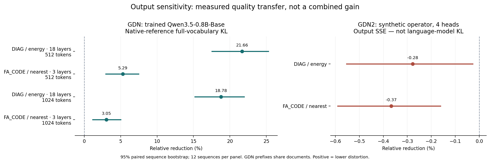

# RTPA — Output-Aware Recurrent-State Quantization

**Quantize recurrent state with output sensitivity in mind.**

RTPA brings output sensitivity into recurrent-state quantization. It uses
offline response measurements to guide **fixed precision allocation**
(RTPA-DIAG) and **bounded integer-code correction** (FA_CODE), with quality,
storage and runtime measured separately. Both aim to preserve a model's output
under a fixed state-storage budget; they are separate methods, not a combined
percentage gain.

## What you can use and verify

- **18.78% lower Native-reference KL:** RTPA-DIAG versus matched-energy allocation
  on Qwen3.5-0.8B-Base, all 18 GDN layers, 12 synthetic documents × 1,024 tokens,
  at identical payload (95% paired CI 15.19–21.95%). Next-token NLL improvement
  is unresolved. Decode-cost ratio is 1.116 [0.945–1.286], so the +5% target is
  **not established** in this eager implementation.
- **Output-aware allocation and encoding:** executable GDN storage adapter,
  fixed masks, an encoder with an FP64 diagonal-plus-rank-two metric, and a small Python example.
- **Measured storage:** 19,328 B per 128×128 head, including FP16 metadata and
  eight high rows — 9.4375 bits/value, 41.02% below the same head's BF16 state.
  This is target-state storage, not whole-model VRAM savings.
- **Auditable quality and cost:** public token/sequence scalars, fixed-work
  timing blocks, numerical-failure fixtures and model-free CPU reconstruction.

See the [new benchmark tables](results/upgrade/benchmark_tables.md) for current
GDN quality/cost results and GDN2 operator results, including adverse effects.
On the separate three-layer code-correction path, factorized FA_CODE reduced KL
by 3.05% versus stored-nearest but cost 1.498× [1.360–1.660]; it is not yet a
low-overhead runtime. GDN2 operator SSE slightly worsened with both methods.
Historical DIAG/FA_CODE panels and their task limitations remain in
[full results and boundaries](docs/RESULTS.md). Gains are never added together.

## Support and measurement scope

| Architecture | Executable path | Evidence level |
|---|---|---|
| GDN / Qwen3.5-0.8B-Base, fixed revision | Native whole-model token steps; all 18 recurrent-layer allocation; separate layers 0/12/22 FA_CODE | `MODEL_EVALUATED`; exact scope and completion per method in the benchmark tables |
| GDN2 | Independent channel-wise transition/adjoint, calibration and quantized operator runner | `OPERATOR_TESTED`; no verified official pretrained checkpoint integration, no language-model KL/NLL claim |

The measured GPU is an RTX 5080 16 GB, with BF16 model/cache and FP32 recurrent
updates. Attention KV, model weights and activations are not quantized here.
Storage uses real UINT8/FP16 tensors and eager encode/decode, not a fused or
optimized packed inference kernel. Known FP16 zero-point overflow is retained,
and passing finite examples does not establish universal codec safety.
[Architecture provenance](docs/ARCHITECTURES.md) · [Numerical limitations](docs/LIMITATIONS.md).

## Quickstart

Install the repository, not an assumed PyPI package:

```bash
git clone https://github.com/Munsik-Kim/rtpa-research.git
cd rtpa-research
python3.11 -m venv ../rtpa-demo-env
source ../rtpa-demo-env/bin/activate
python -m pip install .
python -m rtpa_research demo --out demo.json
python -m rtpa_research verify --out recomputed
python scripts/reproduce_upgrade.py --root . --write-generated recomputed-upgrade --verify
```

The demo and evidence commands require no GPU, Torch, model weights, API key or
private Drive access. They recompute included observations, not new inference.
For an actual state encode/decode example, optional GPU dependencies and the
phased model benchmark, use the [tested guide](docs/QUICKSTART.md).

## How it works

For a fixed response, state-error energy is `eᵀe`, whereas future readout
distortion is `eᵀLᵀLe`. Different error directions can therefore have different
output effects even at the same norm. RTPA uses that distinction in two ways:

1. **RTPA-DIAG:** measure transition/readout responses offline and select eight
   protected rows using `Kii+2ci`. Runtime applies a fixed mask; it does not
   replace the real transition by a diagonal matrix.
2. **FA_CODE:** use a frozen metric `M=lambda I+UUᵀ` to choose limited signed
   code changes at the current write. The factorized FP64 implementation avoids
   dense M storage while retaining the same checked caps, tie order and decoder.

Neither encoder reads future TEST tokens or a Native shadow state. Offline
response predictions are distinguished from the candidate's own nonlinear model
trajectory and actual answers. [Method](docs/METHOD.md) · [Hypotheses](docs/HYPOTHESES.md).



Use the allocation path as the starting research example: its new full-GDN-layer
KL signal is stronger and it uses a static runtime mask. Keep matched energy
alongside it; neither task superiority nor a deployment-speed advantage has
been established. FA_CODE remains an explicit, more expensive research option.

## Evidence, reuse and limits

The repository preserves distinct panels and numerical profiles from the earlier
RTPA study rather than relabeling them with the newest implementation. It also
adds the FA_CODE evidence and new GDN/GDN2 measurements. Historical task panels
did not establish added accuracy over simple baselines; near-ceiling ties do not
prove equivalence. Runtime targets and numerical stability remain separate from
quality gains. This is an actively developed research implementation, not a
production-readiness certificate.

- [Benchmarks and scope](docs/BENCHMARKS.md)
- [Integrated results, including failures](docs/RESULTS.md)
- [Reproducibility and data availability](docs/REPRODUCIBILITY.md)
- [References and baseline provenance](docs/REFERENCES.md)
- [Historical experiment mapping](docs/EXPERIMENTS.md)
- [Current machine-readable claims](results/upgrade/claims.json) · [historical claims](results/claims.json)

## License and citation

Original contributions use **[Apache-2.0](LICENSE)**. Preserve applicable license,
copyright/attribution and [NOTICE](NOTICE) requirements and identify modifications.
See [third-party notices](THIRD_PARTY_NOTICES.md) for the unchanged Qwen tokenizer
attribution and the scope of included materials. External GDN2 code under its
own noncommercial license has not been vendored or relicensed here.

Please cite the repository and the commit used; [CITATION.cff](CITATION.cff)
contains the existing author's citation metadata. A scholarly citation is a
request, not an additional license restriction. No unverified DOI, publication,
world-first claim or official DAMP author-kernel reproduction is implied.
